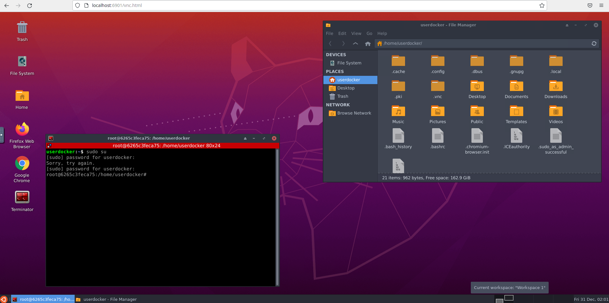

# Desktopus - Portable desktop workspaces using Docker containers.

> Note: Don't hype. This is a software I want to do on my spare time to solve my **own** problems. It could end being good, it could end without an end, or even it could end not being a viable project.



This is the beginning of a large project I have in mind (**Desktopus**) to provision desktop workspaces on any host (local or remote serves) with Docker or Kubernetes clusters.

What **Desktopus** would try to solve?:

- Having different workspaces for different projects with different configured software.
- Create reproducible development workspaces.
- Reduce the learning curve of new technologies by creating prepared and documented desktop workspaces to work with different technologies.
- Use all resources of the bare metal machine instead of using Virtual machines while using different desktop workspaces.
- Be able to export a workspace and run it on any computer, remote server with Docker installed, or a Kubernetes cluster.
- Maybe in the long run, create a "DesktopusHub" where people can share their own desktop workspaces. This could be done by sharing their own files which will be basic zip files containing metadata and scripts to build those images (like `.jar`'s of the Java World).
- Being agnostic of any external service and build images on the first run, to improve security and reduce costs.
- Have an easy to use webapp to create, run and import/export workspaces.

For example let's suppose that there will be some canonical/axiomatic images like:

- `desktopus/ubuntu-base-xfce`
- `desktopus/centos-xfce`
- `desktopus/alpine-xfce`

The idea is to let the people to extend those images by using the standard Dockerfile format, but with some rules so the images can be reused.

> But this currently exists on VSCode, and it is called Remote containers. Why are you doing that?

Ok, try to run your legacy software in VSCode. Try to run software which only is possible to run with GTK libraries. Try to run Blender, KDenlive... The idea is to bring portable desktop workspaces.

## Desktopus RoadMap - Phase 1
The current state of this repository is the first PoC to check viability of working with docker containers and desktop workspaces. On this first phase I will test different approaches to make images easily extensible and create various multiple examples extending of a base ubuntu image.

These are the goals of this phase:

- [ ] Make examples of different desktop workspaces for different tech stacks:
    - [ ] Normal Office usage (Libre Office, GIMP, Email client)
    - [ ] Java development (IntelliJ, Eclipse, VSCode...)
    - [ ] Node development (Node, npm)
    - [ ] Combined workflows
    - [ ] Latex/Pandoc writing
    - [ ] Python Data Science
- [ ] All images should work on linux, and partially (without sound) in Windows and Mac.
- [ ] Don't use `privileged` mode with Docker in Docker.

## Desktopus RoadMap - Phase 2

- [ ] GPU acceleration (Nvidia at the moment on Linux machines)
- [ ] (Maybe?) Make dockerfiles compatible with x11Docker (https://github.com/mviereck/x11docker). If running locally, using X11 can improve performance. Also x11Docker seems to take care a lot of security and isolation.
- [ ] Stream audio using ffmpeg instead of using pulseaudio socket for better isolation. This sould be easily embebable in noVNC. This will help also to make **Desktopus** cross platform, because it will not depend on pulseaudio installed in the host machine.
- [ ] Create a web application where we can configure, create and run workspaces. There will be a server which will call an agent. The agent on this phase will run and build images locally.
- [ ] It would be great to have a Electron client app so noVNC, audio streaming and keyboard shortcuts can be used in an unique client.
- [ ] Use other desktop environments or window managers
## Desktopus RoadMap - Phase 3
- [ ] Add to the agent the ability to deploy workspaces in Kubernetes
- [ ] Create a common format to share images between multiple Desktopus clients.
- [ ] Create a community public web to share Desktopus workspaces! 

# Desktopus PoC (Currently in phase 1)

At the moment there is only an _Ubuntu 20.04_ image with XFCE as a base image. Also some modules are created in `/src/modules`.
Each module represents a software to be installed on the `base` image. All workspaces are defined in the `workspaces.csv` format. 

Each module has three kind of files:

- `installation.sh`: This is how the module will be installed in the workspace.
- `file-desktop.desktop`: Definition of the Desktop file for the module if needed.
- `supervisor.conf`: If the module is a daemon, it is necessary to configure its own supervisor config files.

## Current base images and modules:

- Ubuntu:
    - Versions:
        - 20.04 with XFCE
    - Modules:
        - `docker`
        - `docker-compose`
        - `firefox`
        - `chrome`

## Example workspaces in `workspaces.csv`

|Name|Base|Modules|
---|---|---|
|ubuntu-20.04-xfce-firefox-chrome-docker|ubuntu:20.04-xfce|docker:20.10.12,docker-compose:1.29.2,firefox,google-chrome|
|ubuntu-20.04-xfce-docker|ubuntu:20.04-xfce|docker:20.10.12|
|ubuntu-20.04-xfce-docker|ubuntu:20.04-xfce|


## Generate workspaces

The input file which contains information of workspaces to be generated is in `workspaces.csv`

```
./generate_workspaces.sh
```
This will generate two directories:
- `generated_workspaces/`: Contains a buildable Docker image with all the modules specified.
- `generated_workspaces_zips/`: The same as `generated_workspaces` but in zip files

## Basic Build and Run of your workspace:

1. Go to `generated_workspaces` directory and go to your desired workspace.
2. Execute `create_image.sh` to build the image of the workspace.
3. Run your workspace:

```
./run_workspace.sh --basic
```

In your browser and go to: `http://localhost:6901/vnc.html` and log in to noVNC.
You can also configure a VNC client and connect to `localhost:5901`

> Note, all the data generated at `/home/userdocker/shared-home` in the container will be preserved in your workspace directory at `shared-home` to persist your data. If you want to add more volumes you will need to modify the `run_workspace.sh` script of your workspace.

## Run with audio(pulseaudio) (Only Linux distributions):

_Tested in Ubuntu and Manjaro_

It suports:
- Audio
- Docker in Docker

> Note: This will create a socket file `/tmp/pulseaudio.socket` which will be used in the docker container
> to send audio to the pulseaudio server running in your host machine.

```
./run_workspace.sh --audio
```

Go to your browser and go to: `http://localhost:6901/vnc.html` and log in to noVNC.
You can also configure a VNC client and connect to `localhost:5901`

## Run with Docker in Docker

If you have in your workspace the `docker` module, you will need to run the container as `--privileged`.

> Warning!: Privileged breaks container isolation and it is insecure for production environments.
> I want to provide Nestybox Sysbox support in the future.

To run on priviled mode, you just need to execute appending `-privileged` at the end of the comand. For example:

```
./run_workspace.sh --basic-privileged
```
or
```
./run_workspace.sh --audio-privileged
```
## Default credentials

- Ubuntu user password: userpassword
- VCN Password: vncpassword

## Change default configurations
- **Resolution**: If you want to change the default resolution (1920x1080) you can set it by exporting the env variable `RESOLUTION`.
- **VNC password**: You can set it by using `VNC_PW` env variable.
- **User password**: You can set it by using `USER_PASSWORD` env variable.

Example:
```
export RESOLUTION=1280x720
export VNC_PW=changeme_vnc
export USER_PASSWORD=changeme_user
./run_workspace.sh --basic
```
